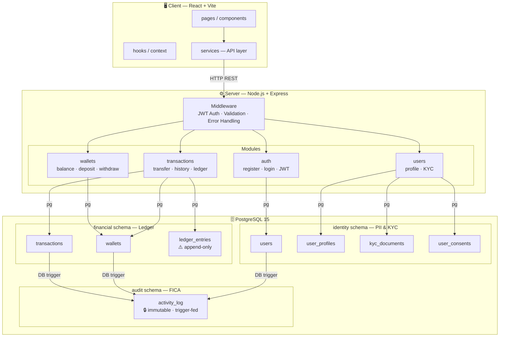

# Omni Wallet 💳

> A South African digital wallet application built with the PERN stack, featuring a double-entry ledger system and compliance-first architecture.


---

## Overview

Omni Wallet is a portfolio-grade fintech application that demonstrates real-world financial system design patterns. It implements a **double-entry bookkeeping ledger**, **POPIA-compliant data handling**, and **FICA audit trails** — the same principles used in production fintech systems in South Africa.

This project was built to showcase:

- Thoughtful database schema design for financial systems
- Regulatory compliance architecture (POPIA, FICA, SARB)
- Secure authentication and KYC flows
- Immutable transaction ledger with full audit history

---

## Tech Stack

| Layer      | Technology        |
| ---------- | ----------------- |
| Frontend   | React + Vite      |
| Backend    | Node.js + Express |
| Database   | PostgreSQL 15     |
| Auth       | JWT + bcryptjs    |
| Validation | express-validator |
| Security   | helmet, cors      |

---

## System Architecture



---

## Project Structure

```
Omni-Project/
├── client/                  # React frontend (Vite)
│   └── src/
│       ├── components/
│       ├── pages/
│       ├── hooks/
│       ├── services/        # API layer
│       └── context/         # Auth state
├── server/                  # Express API
│   └── src/
│       ├── config/          # DB connection, env
│       ├── middleware/      # Auth, validation, errors
│       ├── modules/
│       │   ├── auth/        # Register, login, JWT
│       │   ├── users/       # Profile, KYC
│       │   ├── wallets/     # Balance, create wallet
│       │   └── transactions/# Ledger engine
│       └── db/
│           ├── migrations/  # Versioned SQL files
│           └── seeds/       # Development data
└── .env.example
```

---

## Database Design

The schema is split into **three PostgreSQL schemas** to separate concerns:

| Schema      | Purpose                                    |
| ----------- | ------------------------------------------ |
| `identity`  | PII, KYC documents, user consents (POPIA)  |
| `financial` | Wallets, transactions, double-entry ledger |
| `audit`     | Immutable activity log (FICA compliance)   |

### Double-Entry Ledger

Every transaction produces exactly **two ledger entries** — one debit and one credit. The ledger is **append-only**: rows are never updated or deleted. Reversals are new entries.

```
User A sends R300 to User B:

financial.transactions   →  1 INSERT  (source + destination wallet IDs)
financial.ledger_entries →  2 INSERTs:
    DEBIT   Wallet A   -R300
    CREDIT  Wallet B   +R300
financial.wallets        →  2 UPDATEs (balance cache)
audit.activity_log       →  auto-populated via DB triggers

Rule: debits must always equal credits
```

### Compliance Decisions

| Requirement               | Implementation                                                                     |
| ------------------------- | ---------------------------------------------------------------------------------- |
| POPIA — right to erasure  | `is_pii_deleted` flag + soft delete. PII fields nulled, financial records retained |
| FICA — 5 year retention   | `data_retention_until` field, hard deletes blocked                                 |
| FICA — audit trail        | Immutable `audit.activity_log`, populated via DB triggers                          |
| POPIA — consent tracking  | Per-purpose consent table with granted/withdrawn timestamps                        |
| Security — no float money | All amounts stored as `BIGINT` cents (R500 = 50000)                                |
| Security — idempotency    | `idempotency_key` (UNIQUE) prevents duplicate transactions on retry                |
| Security — RLS            | Row Level Security enabled, users only access their own data                       |

---

## Getting Started

### Prerequisites

- Node.js v18+
- PostgreSQL 15+
- npm

### Installation

```bash
# Clone the repo
git clone https://github.com/TpKek/omni-project.git
cd omni-project

# Install server dependencies
cd server
npm install

# Install client dependencies
cd ../client
npm install
```

### Database Setup

```bash
# Connect to Postgres and create the database
psql -U postgres -c "CREATE DATABASE omni_wallet;"

# Run migrations
npm run migrate
```

### Running the App

```bash
# Start the backend (development)
cd server
npm run dev

# Start the frontend (development)
cd client
npm run dev
```

Server runs on `http://localhost:5000`
Client runs on `http://localhost:5173`

---

## API Endpoints

### Auth

| Method | Endpoint             | Description        |
| ------ | -------------------- | ------------------ |
| POST   | `/api/auth/register` | Register new user  |
| POST   | `/api/auth/login`    | Login, returns JWT |

### Wallets

| Method | Endpoint                | Description                 |
| ------ | ----------------------- | --------------------------- |
| GET    | `/api/wallets/me`       | Get user's wallet & balance |
| POST   | `/api/wallets/deposit`  | Deposit funds               |
| POST   | `/api/wallets/withdraw` | Withdraw funds              |

### Transactions

| Method | Endpoint                     | Description                   |
| ------ | ---------------------------- | ----------------------------- |
| POST   | `/api/transactions/transfer` | Transfer to another user      |
| GET    | `/api/transactions/history`  | Paginated transaction history |
| GET    | `/api/transactions/:id`      | Single transaction detail     |

---

## Security

- Passwords hashed with **bcryptjs** (cost factor 12)
- Auth via **JWT** with expiry
- HTTP headers secured with **helmet**
- Input validation on all endpoints via **express-validator**
- Row Level Security at the database layer
- `.env` never committed — see `.env.example`

---

## Author

**Albertus Petrus Dreyer** (Bertin)
[@Bertin](https://github.com/Bertin) · Portfolio Project 2026

> Built to demonstrate fintech-grade backend architecture using the PERN stack, with South African regulatory compliance (POPIA & FICA) as a first-class concern.

---

## License

MIT
